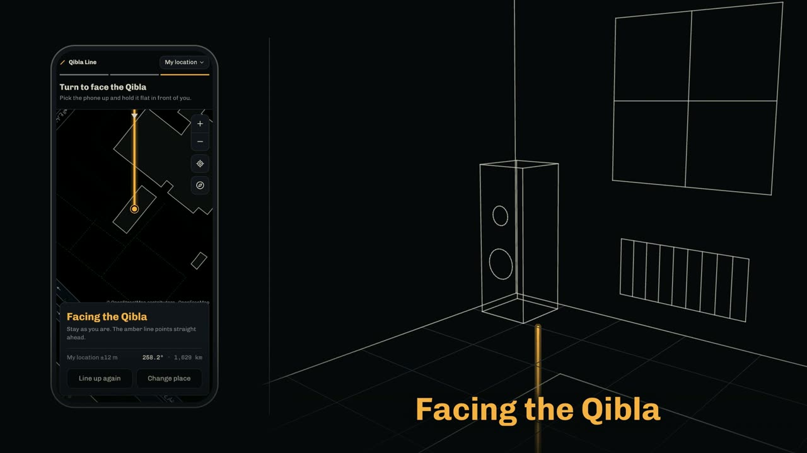
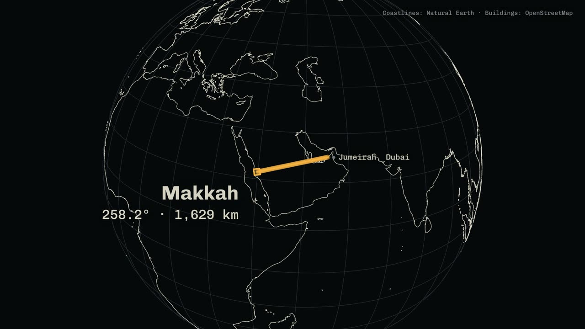

# Qibla Line explainer

A 48-second film that shows how [Qibla Line](https://qiblaline.com) works: why a phone compass can't be trusted indoors, how the app lines a map up with a wall of your room, and the turn to face the Qibla. It plays on the qiblaline.com landing page. The app itself lives at [hashmil/qibla-line](https://github.com/hashmil/qibla-line). Created by [Hash Milhan](https://hashir.net).

<p align="center">
  
  
</p>

Watch it at [qiblaline.com](https://qiblaline.com) on a computer, or download the [MP4](https://qiblaline.com/video/qibla-line.mp4).

It is a single [HyperFrames](https://hyperframes.heygen.com) composition (`index.html`, 1920x1080, 30fps): one Three.js world with a scripted camera, holding an outlined living room, a real Jumeirah 1 villa and its neighbours drawn from OpenStreetMap footprints, and a Natural Earth globe. The phone shows real screen captures of the live app. Captions are part of the picture. Design tokens are in `frame.md` and come from the app's own `DESIGN.md`.

## Preview and render

Needs Node.js 22 or newer and FFmpeg.

```bash
npm install
npm run dev
npm run check
npm run render
```

`npm run dev` opens the HyperFrames Studio preview. Studio adds `data-hf-id` attributes to `index.html` while it is open; strip them before committing.

The site uses a web encode of the render:

```bash
ffmpeg -i renders/qibla-line-explainer.mp4 -c:v libx264 -preset slow -crf 28 -pix_fmt yuv420p -c:a aac -b:a 128k -movflags +faststart qibla-line.mp4
```

## Regenerating assets

- `scripts/capture-screens.mjs` captures the app's screens with Playwright and Chrome into `assets/screens/` (not committed). Run it as `APP_URL=https://qiblaline.com/ FINAL_BEARING=297 node scripts/capture-screens.mjs`, then make the two sizes the film reads: 780x1688 JPEGs in `assets/screens-jpg/` and 390x844 JPEGs in `assets/screens-sm/`.
- `scripts/tick-tracks.py` builds the ratchet tick tracks for the dial and the turn.
- `scripts/eleven-sfx.mjs` generates the sound effects with ElevenLabs. It reads an API key from a local `.env` outside this repository; no key is stored here.
- `scripts/coastlines.mjs` and `scripts/globe-sketch.mjs` build the globe's coastlines from Natural Earth.
- `.overpass-jumeirah.json` is the OpenStreetMap building data for the villa and its neighbours.

## Licence and credits

The composition, the scripts, the ambient music bed and the other original work here are MIT licensed; see [LICENSE](LICENSE). These parts are not Hash's and keep their own terms:

- **Fonts** (`assets/fonts/`): Chivo and Chivo Mono © The Chivo Project Authors ([Omnibus-Type](https://github.com/Omnibus-Type/Chivo)), SIL Open Font License 1.1. The licence is in `assets/fonts/OFL.txt`.
- **Map imagery** (`assets/map/*.png`): OpenStreetMap map tiles, © [OpenStreetMap](https://www.openstreetmap.org/copyright) contributors, CC BY-SA 2.0.
- **Building footprints** (`.overpass-jumeirah.json`, `assets/map/buildings.js`): OpenStreetMap data © OpenStreetMap contributors, Open Database Licence.
- **Coastlines** (`assets/map/coastlines-50m.js`): [Natural Earth](https://www.naturalearthdata.com) (public domain) via [world-atlas](https://github.com/topojson/world-atlas) © Mike Bostock, ISC.
- **Sound effects** (`assets/sfx-el/`, and the tick tracks in `assets/audio/ticks-*.wav` built from them): generated with [ElevenLabs](https://elevenlabs.io). Not covered by the MIT licence.
- **App screens** (`assets/screens-jpg/`, `assets/screens-sm/`): captures of [Qibla Line](https://github.com/hashmil/qibla-line). The maps in them are © OpenStreetMap contributors, with building outlines from [OpenFreeMap](https://openfreemap.org), © [OpenMapTiles](https://openmaptiles.org).
- **Libraries**, loaded at render time and not included here: [Three.js](https://threejs.org) (MIT), [GSAP](https://gsap.com) (GSAP Standard License), [HyperFrames](https://hyperframes.heygen.com). Build scripts use [topojson-client](https://github.com/topojson/topojson-client) and [d3-geo](https://github.com/d3/d3-geo) (ISC) and [Playwright](https://playwright.dev) (Apache 2.0).
